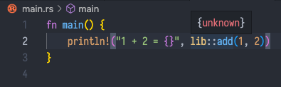

This is a reproduction of the bug reporeted in [rust-analyzer: Choose the library's `display_name` as much as possible. · Issue #1032 · bazelbuild/rules_rust](https://github.com/bazelbuild/rules_rust/issues/1032#partial-timeline)

```shell
$ RUST_LOG=debug bazel run @rules_rust//tools/rust_analyzer:gen_rust_project
INFO: Analyzed target @rules_rust//tools/rust_analyzer:gen_rust_project (0 packages loaded, 0 targets configured).
INFO: Found 1 target...
Target @rules_rust//tools/rust_analyzer:gen_rust_project up-to-date:
  bazel-bin/external/rules_rust/tools/rust_analyzer/gen_rust_project
INFO: Elapsed time: 0.082s, Critical Path: 0.00s
INFO: 1 process: 1 internal.
INFO: Build completed successfully, 1 total action
INFO: Build completed successfully, 1 total action
[2021-11-25T07:56:59Z DEBUG gen_rust_project_lib] Building rust_analyzer_crate_spec files for ["@//..."]
[2021-11-25T07:56:59Z DEBUG gen_rust_project_lib::aquery] Get crate specs with targets: ["@//..."]
[2021-11-25T07:56:59Z DEBUG gen_rust_project_lib::aquery] CrateSpec { crate_id: "ID-lib.rs", display_name: "test_lib", edition: "2018", root_module: "lib.rs", is_workspace_member: true, deps: {}, proc_macro_dylib_path: None, source: None, cfg: ["test", "debug_assertions"], env: {}, target: "x86_64-unknown-linux-gnu" }
[2021-11-25T07:56:59Z DEBUG gen_rust_project_lib::aquery] CrateSpec { crate_id: "ID-main.rs", display_name: "main", edition: "2018", root_module: "main.rs", is_workspace_member: true, deps: {"ID-lib.rs"}, proc_macro_dylib_path: None, source: None, cfg: ["test", "debug_assertions"], env: {}, target: "x86_64-unknown-linux-gnu" }
[2021-11-25T07:56:59Z DEBUG gen_rust_project_lib::aquery] CrateSpec { crate_id: "ID-lib.rs", display_name: "lib", edition: "2018", root_module: "lib.rs", is_workspace_member: true, deps: {}, proc_macro_dylib_path: None, source: None, cfg: ["test", "debug_assertions"], env: {}, target: "x86_64-unknown-linux-gnu" }
```

The library target "lib" will be consolidated into "test_lib" since the CrateSpec of
"test_lib" takes precedence:

```shell
$ cat rust-project.json | jq .
{
  "sysroot_src": "/home/ryo.takahashi/.cache/bazel/_bazel_ryo.takahashi/daa6394f9a4fb88c61035b847b70ddcf/execroot/__main__/external/rust_linux_x86_64/lib/rustlib/src/library",
  "crates": [
    {
      "display_name": "test_lib",
      "root_module": "lib.rs",
      "edition": "2018",
      "deps": [],
      "is_workspace_member": true,
      "cfg": [
        "test",
        "debug_assertions"
      ],
      "target": "x86_64-unknown-linux-gnu",
      "env": {},
      "is_proc_macro": false
    },
    {
      "display_name": "main",
      "root_module": "main.rs",
      "edition": "2018",
      "deps": [
        {
          "crate": 0,
          "name": "test_lib"
        }
      ],
      "is_workspace_member": true,
      "cfg": [
        "test",
        "debug_assertions"
      ],
      "target": "x86_64-unknown-linux-gnu",
      "env": {},
      "is_proc_macro": false
    }
  ]
}
```

Rust Analyzer cannot find the actual source of the `lib`:


